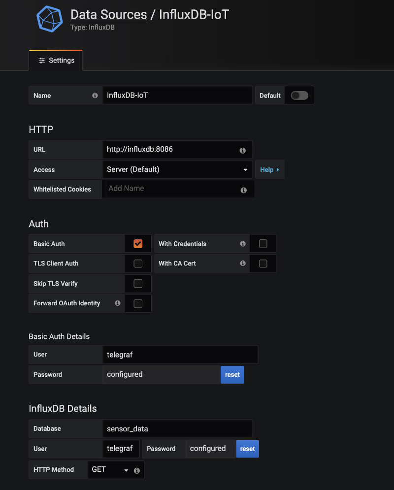

# Temperature and Humidity Monitor
Monitor the temperature and humidity of a room using the DHT11 sensor on a raspberry pi with InfluxDB, Grafana, IFTTT and Python. This project uses a simple python script to send output from the DHT11 sensor to InfluxDB based on an `internal` value that you provide in a `settings.conf` file (a sample has been provided). This script will also alert you via custom created IFTTT applet using IFTTT webhooks and set values for `temperature_threshold_low` and `temperature_threshold_high` in the `settings.conf` file. 

**PLEASE NOTE:** This project is a WIP and still under construction. Will likely change and be updated at some point. There are no default values or any real error handling currently.

### Prerequisites
- Raspberry Pi
- DHT11 Sensor 
- Influx (*If not using Docker*)
- Grafana (*If not using Docker*)
- Docker (*Optional*)
- Python3 

## Setting up the Pi
There are far too many resources available online to explain or discuss Raspberry Pi setup. To each his/her own. Raspbian was used in the current project.

As good reference for Raspberry Pi and DHT11 setup, please see this [doc](http://www.circuitbasics.com/how-to-set-up-the-dht11-humidity-sensor-on-the-raspberry-pi/).

## Setting up Python
We will be using a few Libraries that need installed either via `pip` or via `requirements.txt` file. `requirements.txt` file  has more than needed as it was dumped directly from Pi. Run these steps from your Pi to prepare Python.

```bash
pip3 install -y requests Adafruit_DHT influxdb
```

OR

```bash
pip3 install -r requirements.txt
```
For more information about these libraries see their docs:

- [Adafruit DHT Sensors](https://github.com/adafruit/Adafruit_Python_DHT)

- [Influx-Py](https://github.com/influxdata/influxdb-python)

## Setting Up Influx and Grafana
For convenience, we are using Docker. You can simply use the provided `docker-compose.yml` file or issue the following commands steps:

```bash 
# For Influx
sudo docker volume create influxdb
sudo docker run -d --name influxdb -p 8086:8086 -p 8083:8083 -v influxdb:/var/lib/ifluxdb    -e INFLUXDB_ADMIN_ENABLED=true -e INFLUXDB_USER=telegraf -e INFLUXDB_USER_PASSWORD=secretpassword influxdb
# For Grafana
sudo docker volume create grafana
sudo docker run -d --link influxdb --name grafana -v grafana:/var/lib/grafana -p 3000:3000 grafana/grafana
```

Create the DB using the following:
```bash
curl -i -XPOST http://influx:8086/query --data-urlencode "q=CREATE DATABASE sensor_data"
```

Login into Grafana and setup your connection with the following:




## Setting up IFTTT
This project uses IFTTT Web hooks to alert you based on the `temperature_threshold_low` and `temperature_threshold_high` values in your `settings.conf` file. You will need to create your own applet based on what kind of alert you would like to receive. Please see the [IFTTT](https://ifttt.com) site for more information.

You can use the instructions at the Medium Blog post location [here]().


## Running the Script
Once you have completed all steps above, please fill in the `settings.conf` and put it in the same directory as the script. 

Execute in the background:
```bash 
sudo python3 sensor-config.py &
```

## Tests
You may use the following scripts as tests to ensure each indvidual components work as expected.

#### Testing the Pi and Sensor

#### Testing Influx

#### Testing IFTTT 
